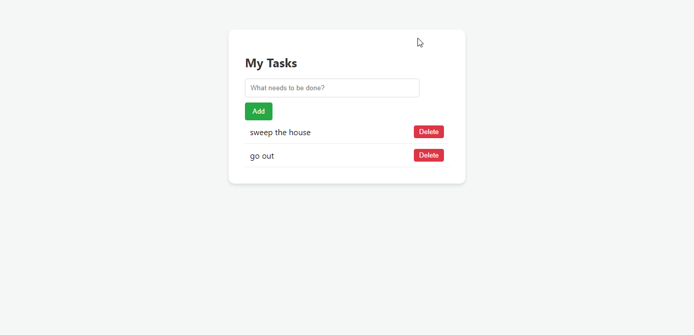

# 📝 TaskFlow: Persistent Flask To-Do App

TaskFlow is a clean, lightweight web application designed to help users manage daily tasks. Unlike basic tutorial apps, it features a **persistent storage system**, meaning your tasks remain saved even after closing the browser or restarting the server.

---

## 🌟 Key Features

* **✨ Create & Delete:** Easily add new tasks or remove completed ones with a single click.
* **💾 Data Persistence:** Tasks are synced to a local `task.json` file automatically.
* **🎨 Modern UI:** A responsive CSS card-based layout for a sleek user experience.
* **🔒 Safe Deletion:** Uses `POST` methods to protect against accidental deletions from crawlers.
* **🚫 Custom 404 Page:** Includes a dedicated "Page Not Found" handler for better navigation.

---

## 🛠️ Tech Stack

| Layer | Technology |
| :--- | :--- |
| **Backend** | Python 3.x, Flask |
| **Frontend** | HTML5, CSS3, Jinja2 |
| **Storage** | JSON (Flat-file database) |

---

## 📸 Preview



---

## 📦 Installation & Setup

Follow these steps to get the project running locally:

### 1. Clone the repository
```bash
git clone [https://github.com/yourusername/taskflow.git](https://github.com/yourusername/taskflow.git)
cd taskflow
